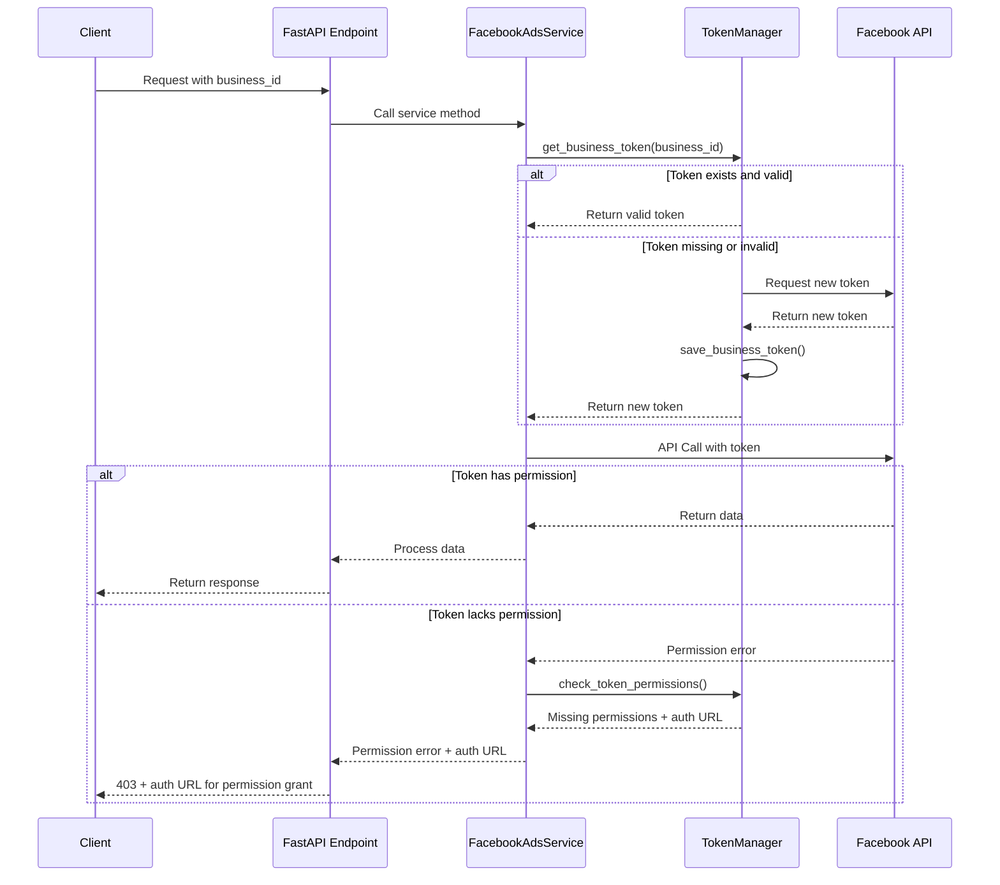

# Technical Design Document: Nâng cao Hệ thống Quản lý Token cho Facebook API

## 1. Tổng Quan

Thiết kế và triển khai các cải tiến cho hệ thống quản lý token Facebook hiện tại để hỗ trợ đầy đủ các loại token cần thiết cho tất cả các endpoints, bao gồm token Business Access cùng với các cơ chế mở rộng quyền, kiểm tra quyền và xử lý token hết hạn trong thời gian chạy.

## 2. Yêu Cầu

### 2.1 Yêu Cầu Chức Năng

- Là một nhà phát triển, tôi muốn có khả năng lưu trữ và quản lý Facebook Business Access Tokens
- Là một người dùng, tôi muốn được thông báo khi token không có đủ quyền truy cập cho một tác vụ
- Là một người dùng, tôi muốn hệ thống tự động làm mới token đã hết hạn trong quá trình sử dụng
- Là một nhà phát triển, tôi muốn có khả năng mở rộng quyền của token hiện có thay vì yêu cầu token mới
- Là một nhà phát triển, tôi muốn có một giao diện nhất quán để truy cập token cho bất kỳ hoạt động nào

### 2.2 Yêu Cầu Phi Chức Năng

- Token phải được lưu trữ một cách bảo mật, mã hóa khi cần thiết
- Hệ thống lưu trữ và lấy token nên là 1 hệ thống tập trung và được sử dụng chung cho mọi chức năng cần thiết(auth, facebook).
- Hệ thống phải có khả năng xử lý tối thiểu 100 yêu cầu/giây
- Quá trình làm mới token phải trong suốt với người dùng cuối
- Thời gian khôi phục từ token không hợp lệ hoặc hết hạn < 2 giây
- Tất cả quy trình xử lý token phải được ghi nhật ký đầy đủ

## 3. Thiết Kế Kỹ Thuật

### 3.1 Data Models

```python
class FacebookBusinessToken(BaseModel):
    """Model đại diện cho Business Access Token"""
    business_id: str
    access_token: str
    token_type: str = "business"
    app_id: str
    expires_at: Optional[datetime] = None
    is_valid: bool = True
    scopes: List[str] = []
    updated_at: datetime = Field(default_factory=datetime.now)

    class Config:
        json_schema_extra = {
            "example": {
                "business_id": "123456789",
                "access_token": "EAA...",
                "token_type": "business",
                "app_id": "987654321",
                "expires_at": "2023-12-31T23:59:59",
                "is_valid": True,
                "scopes": ["business_management", "ads_management"],
                "updated_at": "2023-01-01T12:00:00Z"
            }
        }

class TokenPermissionCheckResponse(BaseModel):
    """Model phản hồi sau khi kiểm tra quyền của token"""
    has_permission: bool
    missing_permissions: List[str] = []
    token_status: str = "valid"  # valid, expired, invalid
    authorization_url: Optional[str] = None
    message: str
```

### 3.2 API Endpoints

```python
# Endpoint lấy Business Token
@router.get("/facebook/business-token", response_model=TokenValidationResponse)
async def get_business_token(
    business_id: str = Query(..., description="ID của Facebook Business"),
):
    """
    Lấy token cho Business Facebook cụ thể.
    Tìm kiếm token trong kho lưu trữ token hoặc thông qua Facebook API.

    Returns:
        TokenValidationResponse: Thông tin token và trạng thái
    """

# Endpoint mở rộng quyền token
@router.post("/facebook/extend-permissions", response_model=TokenValidationResponse)
async def extend_token_permissions(
    token: str = Query(..., description="Token cần mở rộng quyền"),
    permissions: List[str] = Query(..., description="Danh sách quyền cần thêm"),
):
    """
    Mở rộng quyền cho token hiện có.

    Returns:
        TokenValidationResponse: Thông tin token và trạng thái
    """

# Endpoint kiểm tra quyền
@router.get("/facebook/check-permissions", response_model=TokenPermissionCheckResponse)
async def check_token_permissions(
    token: str = Query(..., description="Token cần kiểm tra"),
    required_permissions: List[str] = Query(..., description="Danh sách quyền cần kiểm tra"),
):
    """
    Kiểm tra xem token có đủ quyền cho hoạt động cụ thể không.

    Returns:
        TokenPermissionCheckResponse: Kết quả kiểm tra quyền
    """
```

### 3.3 Services

Mở rộng `TokenManager` và `FacebookAuthService`:

```python
class TokenManager:
    # Methods hiện có...

    async def get_business_token(self, business_id: str) -> Optional[str]:
        """Lấy token cho Business từ kho lưu trữ"""

    async def save_business_token(self, business_id: str, token: str, token_data: Dict = None):
        """Lưu Business token vào kho lưu trữ"""

    async def check_token_permissions(self, token: str, required_permissions: List[str]) -> TokenPermissionCheckResponse:
        """Kiểm tra xem token có đủ quyền không"""

    async def refresh_token_on_demand(self, token: str) -> Optional[str]:
        """Làm mới token theo yêu cầu khi cần thiết"""

class FacebookAuthService:
    # Methods hiện có...

    async def get_business_access_token(self, user_token: str, business_id: str) -> Optional[FacebookBusinessToken]:
        """Lấy Business Access Token từ user token"""

    async def extend_token_permissions(self, token: str, permissions: List[str]) -> Optional[str]:
        """Mở rộng quyền cho token hiện có"""
```

Bổ sung `TokenMiddleware` cho xử lý token hết hạn:

```python
class TokenMiddleware:
    """Middleware xử lý token hết hạn tự động"""

    async def __call__(self, request: Request, call_next):
        """
        Handle token expiry during request processing.

        If a FacebookRequestError is raised with an expired token error,
        attempt to refresh the token and retry the request once.
        """
        # Implementation...
```

### 3.4 Logic Flow



### 3.5 Dependencies

- facebook-business SDK (đã có)
- pydantic (đã có)
- cryptography (đã có)

### 3.6 Security

- Mã hóa token bằng `TokenEncryption` trong kho lưu trữ
- Xác thực token trước mỗi hoạt động quan trọng
- Không bao giờ đưa token vào URL hoặc log
- Triển khai kiểm soát truy cập dựa trên phạm vi của token

### 3.7 Performance

- Caching token với TTL ngắn
- Batch processing cho việc làm mới token
- Sử dụng asyncio để xử lý song song các hoạt động liên quan đến token

## 4. Testing

- Unit tests cho TokenManager và FacebookAuthService
- Integration tests với Facebook API
- Mocking Facebook API để test các tình huống lỗi
- Automated token expiry simulation
- Security testing cho mã hóa token

## 5. Câu Hỏi Mở

- Làm thế nào để xử lý khi Facebook thay đổi cơ chế token/permission?
- Nên lưu trữ token vào database thay vì file không?
- Có cần thiết lập rate limiting cho các API liên quan đến token không?

## 6. Giải Pháp Thay Thế

- Sử dụng OAuth2.0 server để quản lý token thay vì tự xây dựng
- Sử dụng Facebook Server-to-Server API thay vì user tokens
- Truyền token trực tiếp từ frontend thay vì lưu trữ
