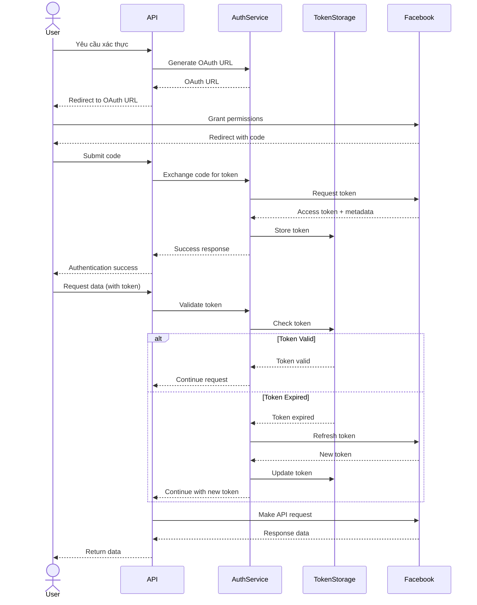

# Technical Design Document: Facebook Authentication Service

## 1. Tổng Quan

FacebookAuthService là một service quản lý xác thực và ủy quyền cho việc truy cập Facebook API. Service này cung cấp các chức năng để xử lý OAuth flow, lưu trữ và quản lý tokens, cũng như tự động refresh tokens khi cần thiết.

## 2. Yêu Cầu

### 2.1 Yêu Cầu Chức Năng

- Cung cấp OAuth flow cho việc xác thực và ủy quyền với Facebook
- Quản lý lifecycle của access tokens và refresh tokens
- Tự động refresh tokens trước khi hết hạn
- Quy trình refresh tokens khép kín các bước
  - Lấy Mã Xác Thực (Authorization Code)
  - Đổi Mã Xác Thực Thành Short-Lived Token
  - Đổi Short-Lived Token Thành Long-Lived Token
  - Sau đó cập nhật lưu trữ lại tokens này
- Cung cấp cơ chế lưu trữ tokens đơn giản bằng json
- Kiểm tra và xác thực tokens
- Hỗ trợ xử lý lỗi và retry

### 2.2 Yêu Cầu Phi Chức Năng

- Đảm bảo bảo mật cao cho các tokens
- Đảm bảo availability của auth service
- Tối thiểu hóa round-trips đến Facebook API
- Hỗ trợ đồng thời nhiều business accounts và pages
- Tương thích với rate limits của Facebook API

## 3. Thiết Kế Kỹ Thuật

### 3.1 Data Models

```python
class FacebookAuthCredential(BaseModel):
    app_id: str
    app_secret: str
    redirect_uri: str
    scopes: List[str]

class FacebookUserToken(BaseModel):
    user_id: str
    access_token: str
    token_type: str = "user"
    expires_at: Optional[datetime] = None
    is_valid: bool = True
    scopes: List[str] = []
    created_at: datetime = Field(default_factory=datetime.now)
    updated_at: datetime = Field(default_factory=datetime.now)

class FacebookPageToken(BaseModel):
    user_id: str
    page_id: str
    page_name: str
    access_token: str
    token_type: str = "page"
    category: Optional[str] = None
    expires_at: Optional[datetime] = None
    created_at: datetime = Field(default_factory=datetime.now)
    updated_at: datetime = Field(default_factory=datetime.now)

class TokenValidationResponse(BaseModel):
    is_valid: bool
    app_id: str
    application: str
    user_id: Optional[str] = None
    scopes: List[str] = []
    expires_at: Optional[datetime] = None
    error_message: Optional[str] = None
```

### 3.2 API Endpoints

```
POST /api/v1/auth/facebook/authorize
    - Generate OAuth URL for user authorization

POST /api/v1/auth/facebook/token
    - Exchange code for access token

GET /api/v1/auth/facebook/validate
    - Validate a token and get its details

GET /api/v1/auth/facebook/user-pages
    - Get list of pages accessible by user token

POST /api/v1/auth/facebook/refresh
    - Force refresh a token
```

### 3.3 Các Thành Phần Chính

#### FacebookAuthService

- Quản lý OAuth flow
- Khởi tạo và quản lý Facebook SDK
- Xác thực và lưu trữ tokens
- Cung cấp tokens cho các service khác

#### FacebookTokenStorage

- Cung cấp lưu trữ an toàn cho tokens
- Cho phép tìm kiếm tokens theo user ID, page ID
- Quản lý token lifecycle và expiration

#### FacebookTokenRefresher

- Tự động refresh tokens trước khi hết hạn
- Xử lý refresh failures và retries
- Cập nhật token trong storage

### 3.4 Logic Flow



### 3.5 Dependencies

- facebook-business==16.0.0 (Meta for Developers SDK)
- pydantic==1.10.8
- python-jose[cryptography]==3.3.0 (để mã hóa tokens)
- token.json (cho token storage)

### 3.6 Security

- Tokens được encrypt trước khi lưu trữ
- Bảo vệ against token leakage và misuse
- Rate limiting và monitoring cho authentication requests
- Logging đầy đủ cho authentication events
- Token rotation và revocation khi cần thiết

### 3.7 Error Handling

- Xử lý Facebook API errors
- Cơ chế retry với exponential backoff
- Logging chi tiết cho lỗi authentication
- Xử lý gracefully token expiration và refresh failures

## 4. Cân Nhắc Triển Khai

- Tokens nên được lưu trữ trong database với mã hóa thay vì memory
- Cần có cơ chế để revoking tokens khi cần
- Tất cả quy trình này đều là API nên cần có quy trình khép kín để kiểm soát mà không cần UI
- Xử lý edge cases như Facebook API changes và deprecations
- Áp dụng caching cho token validation để giảm calls đến Facebook API

## 5. Kế Hoạch Testing

- Unit tests cho các tính năng của service
- Integration tests với Facebook APIs (sử dụng test accounts)
- Security testing và penetration testing
- Performance testing cho concurrent requests
- Error handling tests

## 6. Monitoring và Alerting

- Track token usage và expiration
- Alert khi tokens không thể refresh
- Monitor rate limits với Facebook API
- Track authentication failures và patterns
- Dashboard cho token health và usage

## 7. Các Khả Năng Mở Rộng Trong Tương Lai

- Enhanced permissions management
- Audit logs cho authentication và authorization
