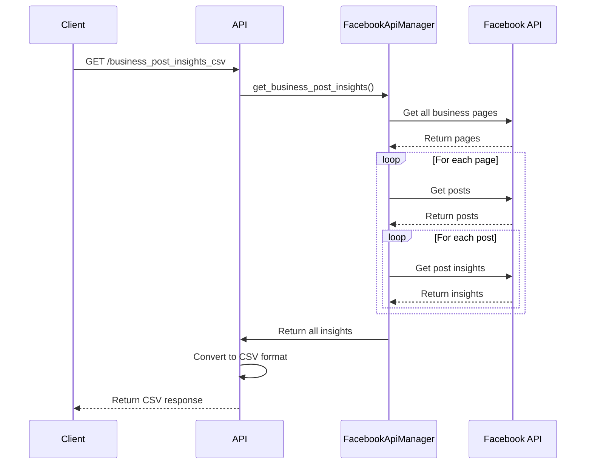

# Technical Design Document: Facebook Business Post Insights

## 1. Tổng Quan

Tính năng Business Post Insights cung cấp khả năng truy xuất và phân tích metrics từ các posts và reels của Facebook Business Pages, cho phép người dùng xuất dữ liệu dưới dạng CSV để phân tích nâng cao.

## 2. Yêu Cầu

### 2.1 Yêu Cầu Chức Năng

- Là một user, tôi muốn xuất metrics của tất cả posts từ một Facebook Business Page để phân tích hiệu suất
- Là một user, tôi muốn lọc posts theo khoảng thời gian để phân tích xu hướng theo thời gian
- Là một user, tôi muốn chỉ định các metrics cụ thể tôi quan tâm để tối ưu hóa dữ liệu
- Là một user, tôi muốn nhận được dữ liệu ở định dạng CSV để dễ dàng nhập vào các công cụ phân tích
- Là một user, tôi muốn phân biệt giữa regular posts và reels để phân tích hiệu suất theo loại nội dung

### 2.2 Yêu Cầu Phi Chức Năng

- API phải xử lý được tối thiểu 20 requests/phút
- Thời gian phản hồi không quá 10 giây cho các Facebook Business có ít hơn 1000 posts
- Có caching cho Facebook API calls để giảm số lượng requests và tăng tốc độ
- Xử lý lỗi tốt và cung cấp thông báo lỗi rõ ràng
- Tuân thủ các rate limits của Facebook API
- Hỗ trợ xuất file có UTF-8 BOM cho tương thích với Excel

## 3. Thiết Kế Kỹ Thuật

### 3.1 Data Models

Sử dụng và mở rộng các models hiện có:

```python
class PostInsight(BaseModel):
    post_id: str
    created_time: datetime
    message: Optional[str]
    type: str
    metrics: Dict[str, Any]
```

Cấu trúc metrics trong `PostInsight` sẽ thay đổi dựa trên các metrics được yêu cầu. Một số metrics phổ biến bao gồm:

- impressions
- reach
- engaged_users
- reactions
- comments
- shares

### 3.2 API Endpoints

#### GET /business_post_insights_csv

Endpoint này trả về metrics của tất cả posts từ một business dưới dạng CSV.

**Request Parameters:**

- `business_id` (required): ID của Facebook Business
- `metrics` (optional, default: "impressions,reach,engaged_users,reactions"): Danh sách metrics cần lấy
- `since_date` (required): Ngày bắt đầu (YYYY-MM-DD)
- `until_date` (required): Ngày kết thúc (YYYY-MM-DD)

**Response:**

- Content-Type: text/csv
- Streaming response với CSV data
- Headers: Content-Disposition với filename phù hợp

#### GET /business_posts_and_reels_insights_csv

Endpoint này trả về metrics của cả regular posts và reels từ một business dưới dạng CSV.

**Request Parameters:**

- `business_id` (required): ID của Facebook Business
- `post_metrics` (optional, default: "impressions,reach,engaged_users"): Metrics cho regular posts
- `reel_metrics` (optional, default: DEFAULT_REEL_METRICS): Metrics cho reels
- `since_date` (required): Ngày bắt đầu (YYYY-MM-DD)
- `until_date` (required): Ngày kết thúc (YYYY-MM-DD)

**Response:**

- Content-Type: text/csv
- Streaming response với CSV data
- Headers: Content-Disposition với filename phù hợp

### 3.3 Services

#### FacebookApiManager

Service này quản lý kết nối tới Facebook Graph API và cung cấp các phương thức để lấy dữ liệu.

**Phương thức chính:**

- `get_business_post_insights(business_id, metrics, since_date, until_date)`: Lấy insights cho tất cả posts từ tất cả pages của một business
- `get_all_business_posts_and_reels_insights(business_id, post_metrics, reel_metrics, since_date, until_date)`: Lấy insights cho cả posts và reels

#### Business logic:

1. Lấy tất cả pages thuộc business sử dụng Facebook Business SDK
2. Cho mỗi page, lấy tất cả posts/reels trong khoảng thời gian
3. Cho mỗi post/reel, lấy metrics được yêu cầu
4. Tổng hợp dữ liệu và convert sang định dạng CSV
5. Sử dụng lại các facebook tokens đã được lấy và lưu trữ thông qua các api auth của hệ thống

#### Error handling:

- Kiểm tra và validate input parameters
- Xử lý FacebookRequestError từ SDK
- Cung cấp meaningful error messages

#### Caching:

- Cache danh sách pages của business (30 phút)
- Cache posts/reels metadata (15 phút)
- Không cache metrics data vì thường xuyên thay đổi

### 3.4 Logic Flow



### 3.5 Dependencies

- facebook-business SDK version 17.0.0 hoặc cao hơn
- fastapi==0.100.0 hoặc cao hơn
- pydantic cho data validation

### 3.6 Security

- Lưu trữ Facebook app credentials trong tính năng lưu tokens trong json file đã được sử dụng tại api auth.
- Không lưu access tokens trong logs
- Validate và sanitize tất cả input parameters
- Sử dụng HTTPS cho tất cả API calls
- Exception handling không expose sensitive information

### 3.7 Performance

- Sử dụng async/await cho non-blocking IO
- Implement caching ở nhiều levels
- Optimized batch operations khi có thể
- Sử dụng StreamingResponse để handle large datasets
- Rate limiting để tránh Facebook API throttling

## 4. Testing

- Unit tests cho method validation và CSV generation
- Integration tests với mock Facebook API responses
- Manual testing với real Facebook Business accounts
- Performance testing để verify response times
- Error scenario testing (invalid inputs, API failures)

## 5. Câu Hỏi Mở

- Làm thế nào để xử lý rate limiting từ Facebook API cho businesses với số lượng lớn posts?
- Liệu có nên cung cấp pagination cho big datasets thay vì streaming toàn bộ?
- Có nên xử lý incremental data updates để tránh lấy lại toàn bộ dữ liệu?

## 6. Giải Pháp Thay Thế

- REST API trả về JSON thay vì CSV (đã implement ở một số endpoints khác)
- Asynchronous job processing cho large businesses (start job -> poll status -> get results)
- Scheduled reports thay vì on-demand API calls
- GraphQL API để cho phép clients chỉ định chính xác dữ liệu họ cần
