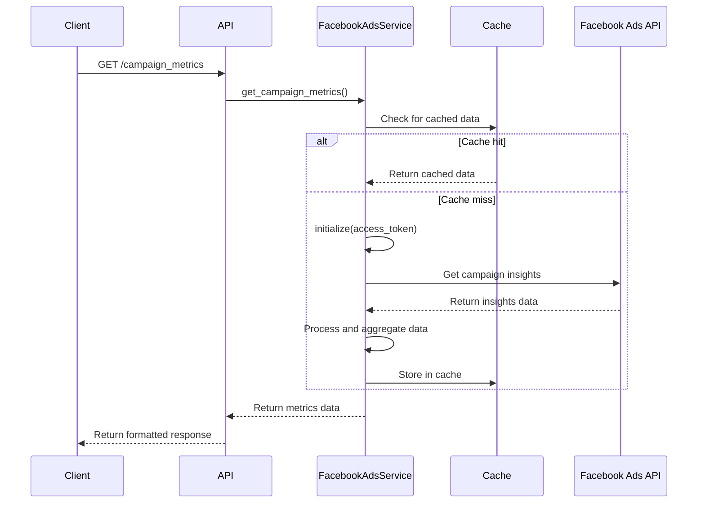

# Technical Design Document: Facebook Campaign Metrics

## 1. Tổng Quan

Tính năng Facebook Campaign Metrics cung cấp khả năng truy xuất và phân tích dữ liệu metrics từ các chiến dịch quảng cáo Facebook, cho phép người dùng đánh giá hiệu suất chiến dịch, so sánh các chiến dịch khác nhau, và xuất báo cáo dưới các định dạng khác nhau.

## 2. Yêu Cầu

### 2.1 Yêu Cầu Chức Năng

- Là một marketer, tôi muốn xem metrics của các chiến dịch quảng cáo Facebook để đánh giá hiệu suất
- Là một marketer, tôi muốn lọc metrics theo khoảng thời gian cụ thể để phân tích xu hướng
- Là một marketer, tôi muốn chỉ định metrics cụ thể tôi quan tâm để tập trung vào KPIs quan trọng
- Là một marketer, tôi muốn xuất dữ liệu dưới dạng CSV để phân tích trong Excel hoặc công cụ BI
- Là một marketer, tôi muốn thấy summary metrics để nhanh chóng nắm bắt tổng quan hiệu suất
- Là một marketer, tôi muốn lọc dữ liệu theo campaign IDs cụ thể để so sánh hiệu suất của các chiến dịch

### 2.2 Yêu Cầu Phi Chức Năng

- API phải xử lý được tối thiểu 30 requests/phút
- Thời gian phản hồi không quá 5 giây cho tài khoản quảng cáo có ít hơn 100 chiến dịch
- Caching cho Facebook API calls để giảm số lượng requests và tăng tốc độ
- Tuân thủ quy định bảo mật và quyền riêng tư của Facebook Ads API
- Hỗ trợ xử lý lỗi và retry logic khi cần thiết
- Khả năng mở rộng để hỗ trợ metrics mới khi Facebook cập nhật API
- Sử dụng lại các facebook tokens đã được lấy và lưu trong tính năng lưu tokens trong api auth

###

## 3. Thiết Kế Kỹ Thuật

### 3.1 Data Models

Sử dụng và mở rộng các models hiện có:

```python
class DateRange(BaseModel):
    start_date: datetime
    end_date: datetime

class AdsInsight(BaseModel):
    account_id: str
    campaign_id: Optional[str]
    campaign_name: Optional[str]
    adset_id: Optional[str]
    adset_name: Optional[str]
    ad_id: Optional[str]
    ad_name: Optional[str]
    metrics: Dict[str, Any]
    dimensions: Dict[str, Any]

class FacebookCampaignMetricsRequest(BaseModel):
    ad_account_id: str
    campaign_ids: Optional[List[str]] = None
    date_range: DateRange
    metrics: List[str]
    dimensions: Optional[List[str]] = None

class FacebookMetricsResponse(BaseModel):
    success: bool = True
    message: Optional[str] = None
    data: List[Dict[str, Any]]
    summary: Optional[Dict[str, Any]] = None
```

### 3.2 API Endpoints

#### GET /campaign_metrics

Endpoint này trả về metrics của các chiến dịch quảng cáo Facebook dưới dạng JSON.

**Request Parameters:**

- `ad_account_id` (required): ID của tài khoản quảng cáo Facebook
- `campaign_ids` (optional): Danh sách ID chiến dịch phân cách bằng dấu phẩy
- `metrics` (optional, default: "spend,impressions,reach,clicks,ctr"): Danh sách metrics cần lấy
- `since_date` (required): Ngày bắt đầu (YYYY-MM-DD)
- `until_date` (required): Ngày kết thúc (YYYY-MM-DD)
- `access_token` (required): Facebook access token với quyền ads_read

**Response:**

- Content-Type: application/json
- JSON object với cấu trúc:
  ```json
  {
    "success": true,
    "message": "Campaign metrics retrieved successfully",
    "data": [...],  // Mảng các campaign metrics
    "summary": {...}  // Tổng hợp metrics của tất cả chiến dịch
  }
  ```

#### GET /campaign_metrics_csv

Endpoint này trả về metrics của các chiến dịch quảng cáo Facebook dưới dạng CSV.

**Request Parameters:**

- Giống với `/campaign_metrics`

**Response:**

- Content-Type: text/csv
- Streaming response với CSV data
- Headers: Content-Disposition với filename phù hợp

### 3.3 Services

#### FacebookAdsService

Service này quản lý kết nối tới Facebook Ads API và cung cấp các phương thức để lấy dữ liệu metrics.

**Phương thức chính:**

- `get_campaign_metrics(ad_account_id, campaign_ids, date_range, metrics, access_token)`: Lấy metrics của các chiến dịch quảng cáo

**Business logic:**

1. Khởi tạo Facebook Ads API với access token
2. Tạo query params với time range, fields, và filtering (nếu có campaign_ids)
3. Gọi API để lấy insights từ ad account
4. Xử lý response và tính toán summary metrics
5. Format dữ liệu theo response model hoặc CSV

**Error handling:**

- Xử lý FacebookRequestError từ SDK
- Validate input parameters
- Cung cấp meaningful error messages
- Retry logic cho temporary errors

**Caching:**

- Cache campaign insights dựa trên thời gian (1 giờ)
- Cache ad account metadata (24 giờ)
- Cache campaign names và structures (12 giờ)

### 3.4 Logic Flow



### 3.5 Dependencies

- facebook-business SDK version 17.0.0 hoặc cao hơn
- fastapi==0.100.0 hoặc cao hơn
- pandas cho data manipulation và aggregation
- python-multipart để xử lý form data
- python-jose để xử lý JWT tokens

### 3.6 Security

- Validate access token trước khi thực hiện bất kỳ API call nào
- Rate limit các requests tới API
- Không lưu access tokens trong logs
- Audit logging cho tất cả các calls tới Facebook Ads API
- HTTPS cho tất cả API calls

### 3.7 Performance

- Asynchronous request handling
- Parallel processing cho multiple campaign metrics
- Efficient caching strategy để giảm calls tới Facebook API
- Batch requests khi có thể
- Pagination cho large result sets

## 4. Testing

- Unit tests cho cả services và API endpoints
- Integration tests với Facebook Marketing API sandbox
- Functional tests với test accounts
- Load testing để xác định và tối ưu bottlenecks
- Error case testing (invalid tokens, rate limits, etc.)

## 5. Câu Hỏi Mở

- Làm thế nào để xử lý sự khác biệt giữa các phiên bản của Facebook Marketing API?
- Làm thế nào để tối ưu hóa việc lấy dữ liệu cho tài khoản với số lượng lớn chiến dịch?
- Liệu chúng ta có nên cung cấp khả năng scheduled reports?
- Có nên tích hợp với data warehousing solution để lưu trữ historical data?

## 6. Giải Pháp Thay Thế

- WebHooks để nhận updates thay vì polling
- Sử dụng Facebook Insights API thay vì Marketing API cho một số use cases
- Scheduled batch processing thay vì real-time API calls
- Custom database cho historical data và trend analysis
