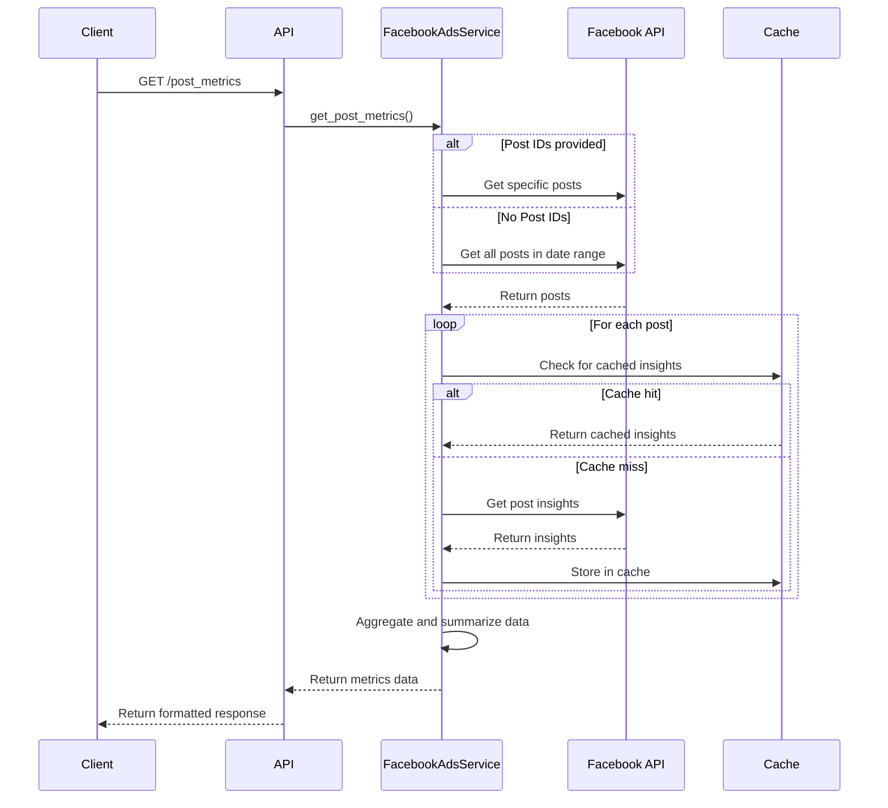

# Technical Design Document: Facebook Post và Reel Metrics

## 1. Tổng Quan

Tính năng Facebook Post và Reel Metrics cung cấp khả năng truy xuất và phân tích metrics từ các posts và reels riêng lẻ trên Facebook Pages, cho phép marketers và content creators đánh giá hiệu suất nội dung, phân tích xu hướng, và tối ưu hóa chiến lược nội dung.

## 2. Yêu Cầu

### 2.1 Yêu Cầu Chức Năng

- Là một content creator, tôi muốn xem chi tiết metrics của các posts cụ thể để đánh giá hiệu suất
- Là một content creator, tôi muốn xem chi tiết metrics của các reels cụ thể để đánh giá hiệu suất
- Là một content manager, tôi muốn xem metrics của tất cả posts trong một khoảng thời gian để phân tích xu hướng
- Là một content manager, tôi muốn xem metrics của tất cả reels trong một khoảng thời gian để phân tích xu hướng
- Là một data analyst, tôi muốn xuất dữ liệu metrics dưới dạng CSV để phân tích nâng cao
- Là một marketer, tôi muốn thấy summary metrics để nhanh chóng nắm bắt tổng quan hiệu suất

### 2.2 Yêu Cầu Phi Chức Năng

- API phải xử lý được tối thiểu 30 requests/phút
- Thời gian phản hồi không quá 5 giây cho Facebook Page có ít hơn 100 posts
- Caching để giảm số lượng calls tới Facebook API
- Xử lý lỗi tốt và cung cấp thông báo lỗi rõ ràng
- Hỗ trợ các metrics mới nhất từ Facebook API
- Tuân thủ rate limits của Facebook API
- Sử dụng lại các facebook tokens đã được lấy và lưu trong tính năng lưu tokens trong api auth

## 3. Thiết Kế Kỹ Thuật

### 3.1 Data Models

Sử dụng và mở rộng các models hiện có:

```python
class PostInsight(BaseModel):
    post_id: str
    created_time: datetime
    message: Optional[str]
    type: str
    metrics: Dict[str, Any]

class VideoInsight(BaseModel):
    video_id: str
    title: Optional[str]
    description: Optional[str]
    created_time: datetime
    metrics: Dict[str, Any]

class FacebookMetricsResponse(BaseModel):
    success: bool = True
    message: Optional[str] = None
    data: List[Dict[str, Any]]
    summary: Optional[Dict[str, Any]] = None
```

### 3.2 API Endpoints

#### GET /post_metrics

Endpoint này trả về metrics cho các Facebook posts cụ thể.

**Request Parameters:**

- `page_id` (required): ID của Facebook Page
- `post_ids` (optional): Danh sách IDs của posts, phân cách bằng dấu phẩy
- `metrics` (optional, default: "impressions,reach,engaged_users,reactions"): Danh sách metrics cần lấy
- `since_date` (required): Ngày bắt đầu (YYYY-MM-DD)
- `until_date` (required): Ngày kết thúc (YYYY-MM-DD)
- `access_token` (required): Facebook access token với quyền truy cập page insights

**Response:**

- Content-Type: application/json
- JSON object với cấu trúc:
  ```json
  {
    "success": true,
    "message": "Post metrics retrieved successfully",
    "data": [...],  // Mảng các post metrics
    "summary": {...}  // Tổng hợp metrics của tất cả posts
  }
  ```

#### GET /post_metrics_csv

Endpoint này trả về metrics cho các Facebook posts dưới dạng CSV.

**Request Parameters:**

- Giống với `/post_metrics`

**Response:**

- Content-Type: text/csv
- Streaming response với CSV data
- Headers: Content-Disposition với filename phù hợp

#### GET /reel_metrics

Endpoint này trả về metrics cho các Facebook Reels.

**Request Parameters:**

- `page_id` (required): ID của Facebook Page
- `reel_ids` (optional): Danh sách IDs của reels, phân cách bằng dấu phẩy
- `metrics` (optional, default: DEFAULT_REEL_METRICS): Danh sách metrics cần lấy
- `since_date` (required): Ngày bắt đầu (YYYY-MM-DD)
- `until_date` (required): Ngày kết thúc (YYYY-MM-DD)
- `access_token` (required): Facebook access token với quyền truy cập page insights

**Response:**

- Content-Type: application/json
- JSON object với cấu trúc:
  ```json
  {
    "success": true,
    "message": "Reel metrics retrieved successfully",
    "data": [...],  // Mảng các reel metrics
    "summary": {...}  // Tổng hợp metrics của tất cả reels
  }
  ```

#### GET /reel_metrics_csv

Endpoint này trả về metrics cho các Facebook Reels dưới dạng CSV.

**Request Parameters:**

- Giống với `/reel_metrics`

**Response:**

- Content-Type: text/csv
- Streaming response với CSV data
- Headers: Content-Disposition với filename phù hợp

### 3.3 Services

#### FacebookAdsService và FacebookApiManager

Các services này quản lý kết nối tới Facebook Graph API và cung cấp phương thức để lấy dữ liệu metrics.

**Phương thức chính:**

- `get_post_metrics(page_id, post_ids, date_range, metrics, access_token)`: Lấy metrics cho các posts
- `get_post_insights(page_id, post_id, metrics, since_date, until_date)`: Lấy insights cho một post cụ thể
- `determine_post_type(post_data)`: Xác định loại nội dung (post thường hay reel)

**Business logic:**

1. Validate input parameters và access token
2. Nếu cung cấp post_ids, lấy metrics chỉ cho các posts cụ thể
3. Nếu không cung cấp post_ids, lấy tất cả posts trong khoảng thời gian
4. Gọi Facebook Graph API để lấy insights cho mỗi post
5. Xác định loại nội dung (post thường hay reel)
6. Tổng hợp dữ liệu và tính toán summary metrics
7. Format dữ liệu theo response model hoặc CSV

**Error handling:**

- Xử lý validation errors
- Xử lý FacebookRequestError từ SDK
- Cung cấp meaningful error messages
- Retry logic cho temporary errors

**Caching:**

- Cache post insights theo post ID và date range (15 phút)
- Cache post metadata (1 giờ)
- Cache page metadata (24 giờ)

### 3.4 Logic Flow



### 3.5 Dependencies

- facebook-business SDK version 17.0.0 hoặc cao hơn
- fastapi==0.100.0 hoặc cao hơn
- python-dateutil cho date handling
- aiohttp cho async HTTP requests
- redis hoặc memcached cho caching

### 3.6 Security

- Validate access token trước khi thực hiện calls
- Sanitize tất cả input parameters
- Không lưu trữ access tokens trong logs
- Chỉ trả về data cho page mà access token có quyền truy cập
- HTTPS cho tất cả API calls

### 3.7 Performance

- Implement caching ở nhiều levels
- Sử dụng async/await cho non-blocking I/O
- Batch processing cho multiple post insights
- Pagination cho large result sets
- Limit số lượng metrics để giảm payload size

## 4. Testing

- Unit tests cho validation logic và data processing
- Integration tests với Facebook Graph API test accounts
- Performance tests cho large datasets
- Testing với các edge cases (posts không có metrics, expired tokens, etc.)
- Mocking Facebook API responses cho test reliability

## 5. Câu Hỏi Mở

- Làm thế nào để xử lý sự khác biệt giữa metrics available cho các loại posts khác nhau?
- Liệu có nên phân tách reel metrics hoàn toàn khỏi post metrics trong code?
- Làm thế nào để đảm bảo backward compatibility khi Facebook thay đổi API?
- Có nên tạo API để discover available metrics cho mỗi loại nội dung?

## 6. Giải Pháp Thay Thế

- GraphQL API để cho phép clients request chính xác các fields họ cần
- Webhook-based system để notify clients về metrics updates
- Combined API cho cả posts và reels thay vì separate endpoints
- Pagination thay vì streaming cho large datasets
