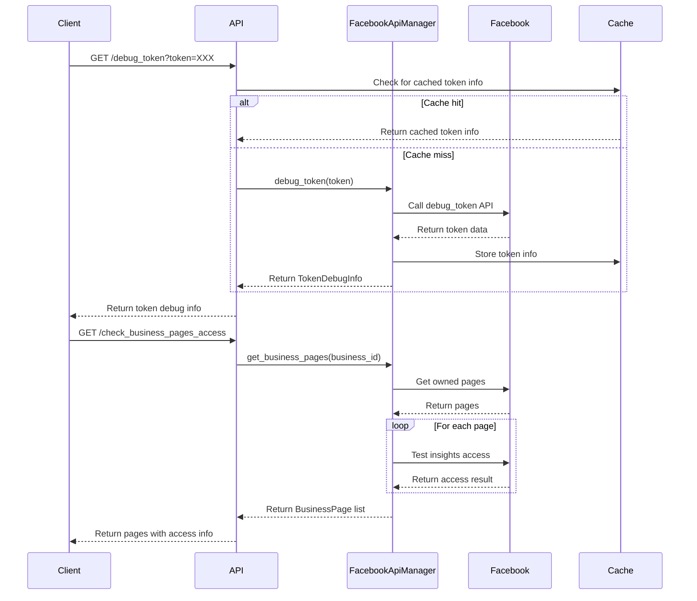

# Technical Design Document: Facebook Utility APIs

## 1. Tổng Quan

Tính năng Facebook Utility APIs cung cấp các endpoints hỗ trợ cho việc quản lý và sử dụng các Facebook APIs khác trong hệ thống. Bao gồm các chức năng như debug access tokens, kiểm tra quyền truy cập vào Facebook Pages, và xem danh sách các metrics có sẵn. Những APIs này giúp developers và marketers xác minh các vấn đề về quyền truy cập, tìm hiểu các metrics có thể sử dụng, và đảm bảo trải nghiệm người dùng suôn sẻ.

## 2. Yêu Cầu

### 2.1 Yêu Cầu Chức Năng

- Là một developer, tôi muốn debug Facebook access tokens để kiểm tra tính hợp lệ và quyền
- Là một user, tôi muốn kiểm tra quyền truy cập vào các Facebook Pages trong một Business để đảm bảo đủ quyền lấy metrics
- Là một developer, tôi muốn xem danh sách các metrics có sẵn cho posts, reels và ads để biết những gì có thể truy vấn
- Là một content manager, tôi muốn biết token của tôi sẽ hết hạn khi nào để chuẩn bị refresh
- Là một admin, tôi muốn biết các Facebook Pages nào trong Business có hỗ trợ insights để lên kế hoạch phân tích

### 2.2 Yêu Cầu Phi Chức Năng

- API phải có thời gian phản hồi nhanh (dưới 2 giây)
- Caching hợp lý để giảm số lượng requests tới Facebook API
- Tuân thủ rate limits của Facebook API
- Xử lý lỗi rõ ràng và hữu ích
- Bảo mật thông tin access token
- Documentation đầy đủ về format responses
- Sử dụng lại các facebook tokens đã được lấy và lưu trong tính năng lưu tokens trong api auth

## 3. Thiết Kế Kỹ Thuật

### 3.1 Data Models

Sử dụng và mở rộng các models hiện có:

```python
class TokenDebugInfo(BaseModel):
    app_id: str
    application: str
    expires_at: Optional[datetime]
    is_valid: bool
    scopes: List[str]
    user_id: str

class BusinessPage(BaseModel):
    id: str
    name: str
    access_token: str
    category: Optional[str]
    has_insights_access: bool
```

### 3.2 API Endpoints

#### GET /available_metrics

Endpoint này trả về danh sách tất cả các metrics có sẵn để sử dụng với API.

**Request Parameters:**

- Không có

**Response:**

- Content-Type: application/json
- JSON object với cấu trúc:
  ```json
  {
    "post_metrics": [...],  // Mảng các metrics có sẵn cho posts
    "reel_metrics": [...],  // Mảng các metrics có sẵn cho reels
    "ads_metrics": [...]    // Mảng các metrics có sẵn cho ads
  }
  ```

#### GET /debug_token

Endpoint này cung cấp thông tin debug về một Facebook access token.

**Request Parameters:**

- `token` (required): Facebook access token cần debug

**Response:**

- Content-Type: application/json
- JSON object với thông tin token:
  ```json
  {
    "app_id": "123456789",
    "application": "My App",
    "expires_at": "2023-12-31T23:59:59",
    "is_valid": true,
    "scopes": ["email", "public_profile", "pages_show_list"],
    "user_id": "987654321"
  }
  ```

#### GET /check_business_pages_access

Endpoint này kiểm tra quyền truy cập vào các pages thuộc về một Facebook Business.

**Request Parameters:**

- `business_id` (required): ID của Facebook Business

**Response:**

- Content-Type: application/json
- JSON array với thông tin page:
  ```json
  [
    {
      "id": "123456789",
      "name": "My Facebook Page",
      "access_token": "EAA...",
      "category": "Business",
      "has_insights_access": true
    },
    ...
  ]
  ```

### 3.3 Services

#### FacebookApiManager và FacebookAuthService

Services này quản lý kết nối tới Facebook Graph API và cung cấp các phương thức utility.

**Phương thức chính:**

- `debug_token(token)`: Debug một Facebook access token
- `get_business_pages(business_id)`: Lấy danh sách pages thuộc về một business
- `test_insights_access(token, page_id)`: Kiểm tra quyền truy cập insights cho một page
- `update_access_token(new_token)`: Cập nhật access token trong session hiện tại

**Business logic:**

1. Các constants cho available metrics được define trực tiếp trong code
2. Debug token sử dụng Facebook API's debug_token endpoint
3. Business pages access kiểm tra từng page và quyền truy cập
4. Testing insights access bằng cách thử gọi page insights API

**Error handling:**

- Xử lý invalid tokens
- Xử lý missing permissions
- Xử lý API errors từ Facebook
- Logging chi tiết để troubleshooting

**Caching:**

- Cache available metrics (24 giờ vì ít thay đổi)
- Cache token debug info (15 phút vì có expiry time)
- Cache business pages (30 phút)

### 3.4 Logic Flow



### 3.5 Dependencies

- facebook-business SDK version 17.0.0 hoặc cao hơn
- fastapi==0.100.0 hoặc cao hơn
- python-dotenv cho environment variables
- aioredis nếu sử dụng Redis cho caching

### 3.6 Security

- Không hiển thị tokens đầy đủ trong logs
- Validate input parameters
- Không lưu access tokens trong response nếu không cần thiết
- Sử dụng HTTPS cho tất cả requests
- Rate limiting để tránh abuse

### 3.7 Performance

- Implement caching cho tất cả các endpoints
- Parallel processing cho business pages check
- Lazy loading khi có thể
- Optimize API calls tới Facebook

## 4. Testing

- Unit tests cho response format và transformations
- Integration tests với Facebook API sandbox accounts
- Security tests cho token handling
- Performance tests cho response times
- Edge case tests (invalid tokens, expired tokens, missing permissions)

## 5. Câu Hỏi Mở

- Làm thế nào để xử lý khi Facebook thay đổi danh sách available metrics?
- Nên lưu trữ thông tin access controls ở đâu để tracking historical changes?
- Có nên cung cấp API để tự động refresh tokens?
- Làm thế nào để notify users khi tokens sắp hết hạn?

## 6. Giải Pháp Thay Thế

- GraphQL API thay vì REST để allow flexible querying
- Webhook system để monitor token expiration
- Scheduled job để verify access controls định kỳ
- Admin dashboard thay vì API endpoints
