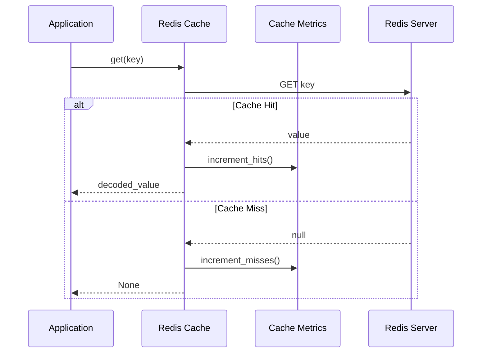

# Technical Design Document: Redis Caching Implementation

## 1. Tổng Quan

Triển khai Redis caching layer cho Digital Metrics API để tối ưu performance và giảm số lượng calls tới Facebook/Google APIs. Redis sẽ được sử dụng để cache responses từ external APIs với TTL (Time To Live) phù hợp.

## 2. Yêu Cầu

### 2.1 Yêu Cầu Chức Năng

- Là một developer, tôi muốn cache responses từ Facebook/Google APIs
- Là một developer, tôi muốn set và get cache data với TTL
- Là một developer, tôi muốn có khả năng invalidate cache khi cần
- Là một developer, tôi muốn monitor được cache hits/misses
- Là một developer, tôi muốn handle được cache failures gracefully

### 2.2 Yêu Cầu Phi Chức Năng

- Cache response time phải dưới 10ms
- Cache size không được vượt quá 1GB
- Cache hit rate tối thiểu 80%
- Hỗ trợ concurrent access
- Có khả năng scale horizontally
- Đảm bảo data consistency

## 3. Thiết Kế Kỹ Thuật

### 3.1 Cache Service Model

```python
class RedisConfig(BaseModel):
    """Redis configuration model."""
    host: str
    port: int
    db: int = 0
    password: Optional[str] = None
    ssl: bool = False
    encoding: str = "utf-8"
    socket_timeout: int = 5
    retry_on_timeout: bool = True
```

### 3.2 Cache Interface

```python
class CacheService(Protocol):
    """Abstract interface for caching service."""

    async def get(self, key: str) -> Optional[Any]:
        """Get value from cache."""
        pass

    async def set(
        self,
        key: str,
        value: Any,
        ttl: int = 300
    ) -> bool:
        """Set value in cache with TTL."""
        pass

    async def delete(self, key: str) -> bool:
        """Delete value from cache."""
        pass

    async def clear(self) -> bool:
        """Clear all cache."""
        pass
```

### 3.3 Redis Implementation

```python
class RedisCacheService(CacheService):
    """Redis implementation of cache service."""

    def __init__(self, redis: Redis):
        self.redis = redis
        self.metrics = CacheMetrics()

    async def get(self, key: str) -> Optional[Any]:
        try:
            if value := await self.redis.get(key):
                self.metrics.increment_hits()
                return json.loads(value)
            self.metrics.increment_misses()
            return None
        except Exception as e:
            logger.error(f"Redis get error: {e}")
            return None
```

### 3.4 Logic Flow



### 3.5 Dependencies

- redis-py==4.5.1
- aioredis==2.0.1
- prometheus-client==0.16.0

### 3.6 Security

- Redis password authentication
- SSL/TLS encryption cho remote connections
- Network security (firewall rules)
- Input validation cho cache keys
- Rate limiting cho cache operations

### 3.7 Performance

- Connection pooling
- Pipelining cho batch operations
- Compression cho large values
- Monitoring và alerting
- Cache eviction policies

## 4. Testing

### 4.1 Unit Tests

```python
async def test_redis_cache_service():
    # Setup
    redis = MockRedis()
    cache = RedisCacheService(redis)

    # Test set
    await cache.set("test_key", {"data": "test"}, ttl=300)

    # Test get
    value = await cache.get("test_key")
    assert value == {"data": "test"}

    # Test delete
    await cache.delete("test_key")
    assert await cache.get("test_key") is None
```

### 4.2 Integration Tests

- Test với real Redis instance
- Test concurrent access
- Test failure scenarios
- Test performance metrics
- Test data consistency

### 4.3 Performance Tests

- Benchmark cache operations
- Measure response times
- Test under load
- Monitor memory usage
- Verify cache hit rates

## 5. Monitoring

### 5.1 Metrics

```python
class CacheMetrics:
    """Cache metrics collector."""

    def __init__(self):
        self.hits = Counter(
            'cache_hits_total',
            'Total number of cache hits'
        )
        self.misses = Counter(
            'cache_misses_total',
            'Total number of cache misses'
        )
        self.errors = Counter(
            'cache_errors_total',
            'Total number of cache errors'
        )
        self.response_time = Histogram(
            'cache_response_seconds',
            'Cache operation response time'
        )
```

### 5.2 Logging

```python
logger = logging.getLogger(__name__)

async def log_cache_operation(operation: str, key: str, duration: float):
    """Log cache operation details."""
    logger.info(
        f"Cache {operation} - Key: {key}, Duration: {duration:.3f}s"
    )
```

## 6. Deployment

### 6.1 Redis Configuration

```yaml
# redis.conf
maxmemory 1gb
maxmemory-policy allkeys-lru
appendonly yes
requirepass ${REDIS_PASSWORD}
```

### 6.2 Environment Variables

```env
REDIS_HOST=localhost
REDIS_PORT=6379
REDIS_PASSWORD=secure_password
REDIS_SSL=true
REDIS_MAX_CONNECTIONS=100
```

## 7. Câu Hỏi Mở

- Có nên implement Redis Cluster cho high availability?
- Strategy cho cache warming?
- Cách xử lý cache stampede?
- Backup strategy cho Redis data?

## 8. Giải Pháp Thay Thế

- Memcached thay vì Redis
- Local in-memory cache
- Distributed cache (Hazelcast)
- CDN caching
