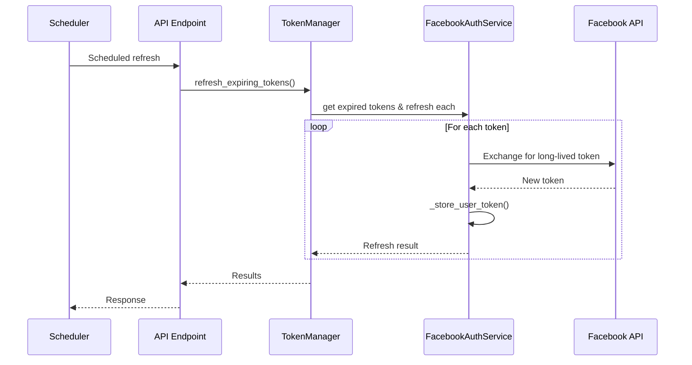
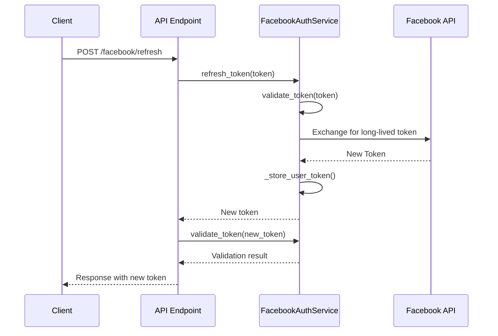

# Technical Design Document: API Refresh Tokens Facebook Tự Động

## 1. Tổng Quan

API này thực hiện việc refresh tokens tự động cho Facebook thông qua quy trình khép kín, giúp duy trì khả năng truy cập liên tục đến Facebook API. API sẽ tận dụng code đã có trong hệ thống, cụ thể là trong các file `app/api/v1/endpoints/auth.py`, `app/services/facebook/auth_service.py` và `app/models/auth.py`.

## 2. Yêu Cầu

### 2.1 Yêu Cầu Chức Năng

- Là một system admin, tôi muốn API tự động refresh Facebook tokens đã hết hạn
- Là một system admin, tôi muốn tokens mới được cập nhật vào JSON file lưu trữ (hiện đã triển khai trong `TokenManager`)
- Là một developer, tôi muốn có thể trigger việc refresh tokens theo yêu cầu
- Là một system admin, tôi muốn được thông báo khi tokens không thể refresh

### 2.2 Yêu Cầu Phi Chức Năng

- Hệ thống phải refresh tokens trước khi chúng hết hạn (xem hiện trạng trong `FacebookAuthService.refresh_token`)
- Quá trình refresh phải xử lý được lỗi và retry
- Thông tin nhạy cảm (client secrets, tokens) phải được mã hóa trong JSON file (đã được triển khai trong `TokenEncryption`)
- API phải có rate limiting để tránh lạm dụng

## 3. Thiết Kế Kỹ Thuật

### 3.1 Data Models

Tận dụng các models đã có trong `app/models/auth.py`:

```python
# Đã có sẵn trong app/models/auth.py
class FacebookUserToken(BaseModel):
    """Model lưu trữ token của Facebook user"""
    user_id: str
    access_token: str
    token_type: str = "user"
    expires_at: Optional[datetime] = None
    is_valid: bool = True
    scopes: List[str] = []
    created_at: datetime = Field(default_factory=datetime.now)
    updated_at: datetime = Field(default_factory=datetime.now)

class FacebookPageToken(BaseModel):
    """Model lưu trữ token của Facebook page"""
    user_id: str
    page_id: str
    page_name: str
    access_token: str
    token_type: str = "page"
    category: Optional[str] = None
    expires_at: Optional[datetime] = None
    created_at: datetime = Field(default_factory=datetime.now)
    updated_at: datetime = Field(default_factory=datetime.now)

class TokenValidationResponse(BaseModel):
    """Kết quả của việc validate token"""
    is_valid: bool
    app_id: str
    application: str
    user_id: Optional[str] = None
    scopes: List[str] = []
    expires_at: Optional[datetime] = None
    error_message: Optional[str] = None

# Bổ sung thêm cho tính năng mới
class TokenRefreshResponse(BaseModel):
    """Kết quả của việc refresh token"""
    success: bool
    message: str
    new_token: Optional[str] = None
    expires_at: Optional[datetime] = None
    is_valid: Optional[bool] = None
```

### 3.2 API Endpoints

Mở rộng từ các endpoints đã có trong `app/api/v1/endpoints/auth.py`:

```python
# Đã có sẵn trong auth.py
@router.post("/facebook/refresh", response_model=Dict[str, Any])
async def refresh_facebook_token(
    token: str = Query(..., description="Facebook token to refresh")
):
    """
    Refresh Facebook access token

    Args:
        token: Facebook access token to refresh

    Returns:
        New token information
    """
    try:
        # Kiểm tra cấu hình Facebook API
        if not facebook_auth_service.app_id or not facebook_auth_service.app_secret:
            raise HTTPException(
                status_code=status.HTTP_500_INTERNAL_SERVER_ERROR,
                detail="Facebook API credentials are not properly configured. Set FACEBOOK_APP_ID and FACEBOOK_APP_SECRET in environment variables.",
            )

        new_token = await facebook_auth_service.refresh_token(token)
        if not new_token:
            return {"success": False, "message": "Token could not be refreshed"}

        # Validate new token
        validation = await facebook_auth_service.validate_token(new_token)
        return {
            "success": True,
            "new_token": new_token,
            "expires_at": validation.expires_at,
            "is_valid": validation.is_valid,
        }
    except Exception as e:
        raise HTTPException(
            status_code=status.HTTP_500_INTERNAL_SERVER_ERROR,
            detail=f"Error refreshing token: {str(e)}",
        )

# Đã có sẵn trong auth.py
@router.post("/facebook/refresh-token", response_model=Dict[str, Any])
@router.get("/facebook/refresh-token", response_model=Dict[str, Any])
async def force_refresh_facebook_token(background_tasks: BackgroundTasks):
    """
    Force refresh Facebook tokens và khởi động background task

    Args:
        background_tasks: FastAPI background tasks runner

    Returns:
        Status và thông tin refresh
    """
    try:
        # Kiểm tra cấu hình Facebook API
        if not facebook_auth_service.app_id or not facebook_auth_service.app_secret:
            raise HTTPException(
                status_code=status.HTTP_500_INTERNAL_SERVER_ERROR,
                detail="Facebook API credentials are not properly configured. Set FACEBOOK_APP_ID and FACEBOOK_APP_SECRET in environment variables.",
            )

        # Gọi token manager để refresh tất cả token trong storage
        success = await token_manager.refresh_all_tokens()

        if success:
            logging.info("Token refresh successful")
            # Khởi động background task để kiểm tra token định kỳ
            await token_refresh_task.start_background_task(background_tasks)

            return {
                "success": True,
                "message": "Token refreshed successfully",
                "next_check": "24 hours",
            }
        else:
            logging.warning("Token refresh failed, generating new OAuth URL")
            # Nếu không thể làm mới, cung cấp link OAuth mới
            auth_url_data = facebook_auth_service.get_authorization_url()
            return {
                "success": False,
                "message": "Token is invalid and could not be refreshed, please complete OAuth flow",
                "authorization_url": auth_url_data["authorization_url"],
                "state": auth_url_data["state"],
            }
    except Exception as e:
        logging.error(f"Error in force_refresh_facebook_token: {str(e)}")
        raise HTTPException(
            status_code=status.HTTP_500_INTERNAL_SERVER_ERROR,
            detail=f"Error refreshing token: {str(e)}",
        )

# Endpoint mới cần thêm vào
@router.post("/facebook/internal/scheduled-refresh", response_model=List[Dict[str, Any]])
async def scheduled_refresh(
    hours_threshold: int = Query(24, description="Số giờ trước khi token hết hạn cần refresh"),
    api_key: str = Depends(internal_api_key_auth)
):
    """
    Endpoint nội bộ được gọi bởi scheduler để refresh tất cả Facebook tokens sắp hết hạn.
    Endpoint này được bảo vệ bởi API key nội bộ.

    Args:
        hours_threshold: Số giờ trước khi token hết hạn sẽ được refresh
        api_key: API key cho internal endpoints

    Returns:
        Danh sách kết quả refresh cho mỗi token
    """
    # Implementation cần bổ sung
```

### 3.3 Services

Mở rộng từ các services đã có trong `app/services/facebook/auth_service.py`:

```python
# Đã có sẵn trong FacebookAuthService
async def refresh_token(self, token: str) -> Optional[str]:
    """
    Refresh token khi sắp hết hạn

    Args:
        token: Token cần refresh

    Returns:
        New access token hoặc None nếu không thể refresh
    """
    try:
        # Kiểm tra các giá trị cấu hình bắt buộc
        if not self.app_id or not self.app_secret:
            logging.error("Missing required configuration (app_id or app_secret)")
            return None

        # Lưu ý: Long-lived page tokens không cần refresh
        # Facebook API hiện cung cấp long-lived user tokens (60 ngày)
        # Cần validate token trước
        validation = await self.validate_token(token)

        # Nếu token không valid hoặc không có thông tin expires
        if not validation.is_valid:
            logging.warning(f"Cannot refresh invalid token: {validation.error_message}")
            return None

        # Kiểm tra expires_at
        if not validation.expires_at or validation.expires_at > datetime.now() + timedelta(days=3):
            # Token còn hạn dài (>3 ngày) hoặc không có expiration
            logging.info("Token does not need refresh yet")
            return token

        # Khởi tạo API với app credential để refresh token
        api = FacebookAdsApi.init(
            app_id=self.app_id,
            app_secret=self.app_secret,
            api_version=self.api_version,
            access_token=token,
        )

        # Exchange code để lấy token
        try:
            token_response = api.call(
                method="GET",
                path="https://graph.facebook.com/v22.0/oauth/access_token",
                params={
                    "grant_type": "fb_exchange_token",
                    "client_id": self.app_id,
                    "client_secret": self.app_secret,
                    "fb_exchange_token": token,
                },
            )
        except Exception as api_call_error:
            logging.error(f"Failed to exchange code for token: {str(api_call_error)}")
            raise AuthError(
                f"Failed to exchange code for token: {str(api_call_error)}",
                "token_exchange_error",
            )

        # Lấy thông tin từ response
        token_data = token_response.json()
        if "access_token" in token_data:
            new_token = token_data["access_token"]
        else:
            raise Exception(f"Failed to exchange code for token: {token_data}")

        if not new_token:
            logging.error("No access token in response")
            raise AuthError("No access token in response", "token_exchange_error")

        # Update token trong storage
        user_id = validation.user_id
        if user_id:
            # Lấy token cũ
            old_token_data = await self._get_user_token(user_id)
            if old_token_data:
                # Tạo token model mới
                new_validation = await self.validate_token(new_token)
                user_token = FacebookUserToken(
                    user_id=user_id,
                    access_token=new_token,
                    token_type="user",
                    expires_at=new_validation.expires_at,
                    is_valid=new_validation.is_valid,
                    scopes=new_validation.scopes,
                    updated_at=datetime.now(),
                )
                # Lưu vào storage
                await self._store_user_token(user_token)

        return new_token
    except FacebookRequestError as e:
        logging.error(f"Facebook API error refreshing token: {str(e)}")
        return None
    except Exception as e:
        logging.error(f"Error refreshing token: {str(e)}")
        return None

# TokenManager - cần bổ sung thêm một số phương thức
class TokenManager:
    """Quản lý các Facebook tokens"""

    def __init__(self):
        self.auth_service = FacebookAuthService()

    async def refresh_all_tokens(self) -> bool:
        """
        Refresh tất cả tokens trong storage

        Returns:
            True nếu ít nhất một token được refresh thành công
        """
        # Implementation hiện có

    async def refresh_expiring_tokens(self, hours_threshold: int = 24) -> List[Dict[str, Any]]:
        """
        Refresh tất cả tokens sắp hết hạn trong X giờ tới

        Args:
            hours_threshold: Số giờ trước khi token hết hạn

        Returns:
            Danh sách kết quả refresh
        """
        # Implementation cần bổ sung
```

### 3.4 Token Storage

Tận dụng JSON storage đã có trong `FacebookAuthService`:

```python
# Đã có sẵn trong FacebookAuthService
def _load_tokens(self):
    """Tải tokens từ file JSON"""
    try:
        if os.path.exists(self.token_file):
            with open(self.token_file, "r") as f:
                self.tokens_data = json.load(f)
            logging.info(f"Loaded tokens from {self.token_file}")
        else:
            self.tokens_data = {"user_tokens": {}, "page_tokens": {}}
            logging.info(f"No token file found at {self.token_file}, created new token store")
    except Exception as e:
        logging.error(f"Error loading tokens from file: {str(e)}")
        self.tokens_data = {"user_tokens": {}, "page_tokens": {}}

def _save_tokens(self):
    """Lưu tokens vào file JSON"""
    try:
        with open(self.token_file, "w") as f:
            json.dump(self.tokens_data, f, indent=2)
        logging.info(f"Saved tokens to {self.token_file}")
        return True
    except Exception as e:
        logging.error(f"Error saving tokens to file: {str(e)}")
        return False

async def _store_user_token(self, token: FacebookUserToken) -> None:
    """Lưu user token vào storage"""
    try:
        # Mã hóa token trước khi lưu
        token_json = token.json()
        encrypted_token = TokenEncryption.encrypt_token(token_json)

        if not encrypted_token:
            logging.error("Failed to encrypt token, storing without encryption")
            token_data = token.dict()
            token_data["encrypted"] = False
        else:
            token_data = {"encrypted": True, "token": encrypted_token}

        # Thêm timestamp
        token_data["updated_at"] = datetime.now().isoformat()

        # Lưu vào dictionary
        if "user_tokens" not in self.tokens_data:
            self.tokens_data["user_tokens"] = {}

        self.tokens_data["user_tokens"][token.user_id] = token_data

        # Lưu vào file
        self._save_tokens()
    except Exception as e:
        logging.error(f"Error storing user token: {str(e)}")
```

### 3.5 Background Task

Tận dụng `TokenRefreshTask` hiện có và mở rộng:

```python
# TokenRefreshTask - Đã có sẵn và cần mở rộng
class TokenRefreshTask:
    """Background task để refresh tokens"""

    def __init__(self):
        self.token_manager = TokenManager()

    async def start_background_task(self, background_tasks: BackgroundTasks):
        """Khởi động background task để refresh tokens"""
        background_tasks.add_task(self._check_and_refresh_tokens)

    async def _check_and_refresh_tokens(self):
        """Kiểm tra và refresh tokens sắp hết hạn"""
        logging.info("Starting token refresh background task")
        await self.token_manager.refresh_expiring_tokens()

    async def schedule_periodic_refresh(self, hours: int = 24):
        """Setup scheduled task để chạy refresh token định kỳ"""
        # Implementation cần bổ sung
```

### 3.6 Logic Flow

Quy trình refresh token tự động:



Quy trình refresh token theo yêu cầu:



### 3.7 Dependencies

Sử dụng các dependencies đã cài đặt:

- fastapi: ^0.95.0
- pydantic: ^1.10.7
- facebook-business: ^22.0.0 (đã sử dụng)
- python-jose: ^3.3.0

### 3.8 Security

- Mã hóa tokens trong JSON file (đã được triển khai qua `TokenEncryption`)
- API key authentication cho internal endpoints
- Rate limiting cho public endpoints
- Logging audit cho mọi thao tác với tokens

## 4. Các tính năng cần mở rộng

1. **Endpoint mới** - Scheduled refresh endpoint cho cron job
2. **TokenManager** - Cải tiến phương thức refresh_expiring_tokens để làm việc với cron job
3. **Background Task** - Cải tiến để hỗ trợ scheduling ổn định hơn
4. **Error Handling** - Cải thiện xử lý lỗi và retry logic

## 5. Giải Pháp Tích Hợp

Tận dụng các thành phần đã có như sau:

1. **Auth Models** - Sử dụng các models hiện có và chỉ thêm một số model mới nếu cần
2. **Auth Service** - Tận dụng FacebookAuthService đã có sẵn phương thức refresh_token
3. **Token Storage** - Sử dụng logic lưu trữ JSON hiện tại
4. **Token Encryption** - Tận dụng TokenEncryption đã triển khai
5. **Background Task** - Mở rộng TokenRefreshTask để hỗ trợ scheduled refresh tốt hơn
