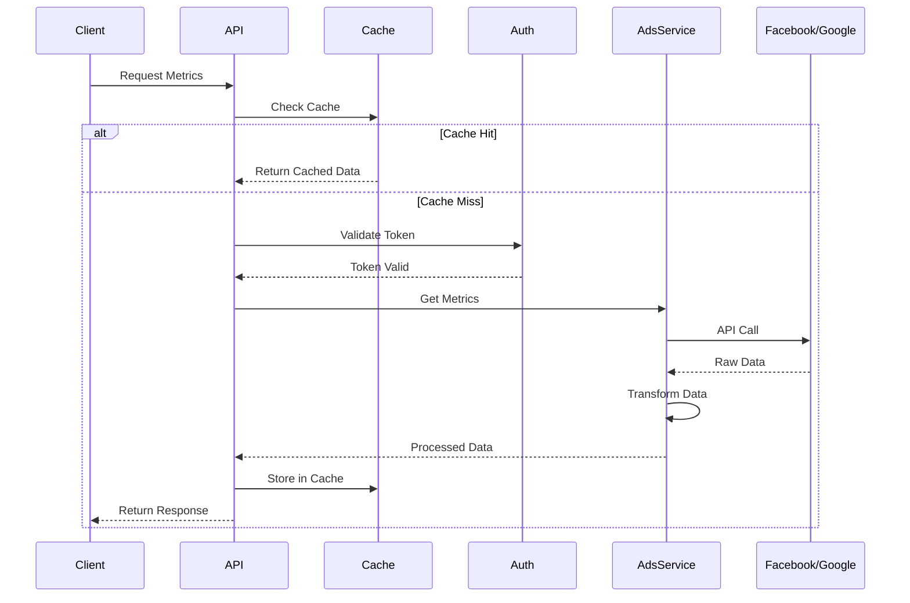

# Technical Design Document: Digital Metrics Platform

## 1. Tổng Quan

Digital Metrics là một nền tảng API để thu thập và phân tích metrics từ Facebook Ads và Google Ads. Hệ thống cung cấp RESTful APIs cho phép users truy xuất, phân tích và xuất báo cáo metrics từ cả hai nền tảng quảng cáo.

## 2. Yêu Cầu

### 2.1 Yêu Cầu Chức Năng

#### Facebook Ads Metrics

- Là một user, tôi muốn xem được metrics của Facebook Ads campaigns
- Là một user, tôi muốn xem được metrics của Facebook posts và reels
- Là một user, tôi muốn lọc metrics theo thời gian và loại metrics
- Là một user, tôi muốn xuất metrics ra file CSV

#### Google Ads Metrics

- Là một user, tôi muốn xem được metrics của Google Ads campaigns
- Là một user, tôi muốn xem được metrics của ad groups
- Là một user, tôi muốn lọc và tổng hợp metrics theo nhiều tiêu chí
- Là một user, tôi muốn xuất báo cáo metrics

### 2.2 Yêu Cầu Phi Chức Năng

- API phải xử lý được 100 concurrent requests
- Response time dưới 500ms cho 95% requests
- Caching cho Facebook/Google API calls với TTL 5 phút
- Rate limiting để bảo vệ APIs
- Đảm bảo bảo mật cho API keys và access tokens
- Hỗ trợ horizontal scaling

## 3. Thiết Kế Kỹ Thuật

### 3.1 Data Models

#### Core Models

```python
class DateRange(BaseModel):
    start_date: datetime
    end_date: datetime

class MetricsFilter(BaseModel):
    date_range: DateRange
    metrics: List[str]
    dimensions: Optional[List[str]]
```

#### Facebook Models

```python
class FacebookMetricsRequest(BaseModel):
    campaign_ids: List[str]
    date_range: DateRange
    metrics: List[str]

class FacebookMetricsResponse(BaseModel):
    data: List[Dict[str, Any]]
    summary: Dict[str, Any]
```

#### Google Models

```python
class GoogleMetricsRequest(BaseModel):
    customer_id: str
    campaign_ids: Optional[List[str]]
    date_range: DateRange
    metrics: List[str]
```

### 3.2 API Endpoints

#### Facebook Endpoints

```
GET /api/v1/facebook/campaigns
GET /api/v1/facebook/campaigns/{campaign_id}/metrics
GET /api/v1/facebook/posts/{post_id}/metrics
GET /api/v1/facebook/reels/{reel_id}/metrics
POST /api/v1/facebook/metrics/export
```

#### Google Endpoints

```
GET /api/v1/google/campaigns
GET /api/v1/google/campaigns/{campaign_id}/metrics
GET /api/v1/google/adgroups/{adgroup_id}/metrics
POST /api/v1/google/metrics/export
```

### 3.3 Services

#### Facebook Service

- Xử lý authentication với Facebook API
- Implement caching cho API calls
- Handle rate limits và retry logic
- Transform data theo response format

#### Google Service

- Xử lý authentication với Google Ads API
- Implement connection pooling
- Cache responses
- Transform và aggregate data

### 3.4 Logic Flow



### 3.5 Dependencies

- fastapi==0.68.1
- uvicorn==0.15.0
- pydantic==1.8.2
- facebook-business==13.0.0
- google-ads==17.0.0
- redis==4.0.2
- celery==5.2.3
- pytest==6.2.5

### 3.6 Security

- JWT authentication cho tất cả endpoints
- Rate limiting: 100 requests/minute per user
- API keys được encrypt trong database
- Input validation cho tất cả requests
- CORS configuration
- Request logging và monitoring

### 3.7 Performance

- Redis caching với TTL 5 phút
- Async operations cho I/O tasks
- Batch processing cho large datasets
- Connection pooling cho databases
- Resource optimization cho memory usage
- Monitoring và alerting system

## 4. Testing

- Unit tests cho tất cả services và endpoints
- Integration tests với Facebook/Google APIs
- Performance testing với locust
- Security testing
- Error scenario testing
- End-to-end testing

## 5. Câu Hỏi Mở

- Có nên implement GraphQL thay vì REST?
- Caching strategy cho large datasets?
- Backup strategy cho metrics data?
- Monitoring solution?

## 6. Giải Pháp Thay Thế

- GraphQL API thay vì REST
- MongoDB thay vì Redis cho caching
- Kafka thay vì Celery cho async tasks
- Docker Swarm thay vì Kubernetes
